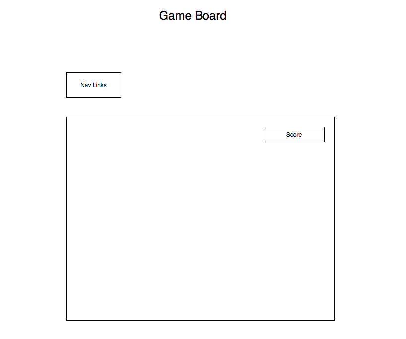
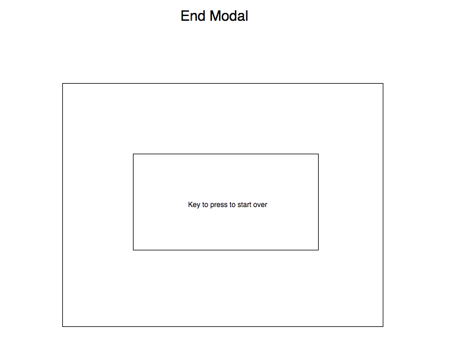

# JOLLY-night

## Background

JOLLY-night is a game where a member of the band JOLLY is trapped in an alley and the only way to survive is by dodging ghouls.

## Functionality & MVP

In JOLLY-night, users will be able to:

- [ ] Start game
- [ ] Jump over or punch ghouls to stay alive
- [ ] Keep score of how many ghouls they've punched to stay alive

## Wireframes

This game will consist of a single screen with game board, score counter and game controls.  Game controls will include Start, arrow key directions, jump and punch button.

## Architecture and Technologies

This project will be implemented with the following technologies:

- `JavaScript` for game logic
- `HTML5 Canvas` for rendering

## Implementation Timeline

**Day 1**: Set up Node modules and basic entry files.  Get background rendering with canvas and research iterating through image files for animation.

**Day 2**: Key control logic and rendering character movement and ghouls coming at the character

**Day 3**:  Collision detection to determine if the game is over or user wins a point

**Day 4**: Polish game, create modals and NavLinks
